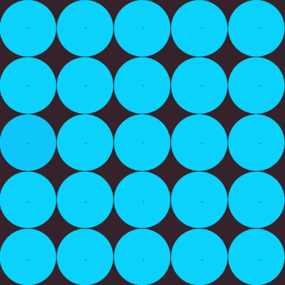

# Different-Color-Game-cheat

### Giới thiệu
Vì mình lười chơi trong khi bạn mình rủ chơi nên mình tạo ra cái tool này để nó đánh hộ mình

### Demo
Nói sơ qua chút về luật chơi thì game này là một game trend trên Facebook trong một thời gian trước. Nhiệm vụ của người chơi là chọn ra ô có màu khác biệt trong số các ô hiện ra trên màn hình!
Clip demo này mình quay để up story Facebook nên không quá đầu tư: {@youtube: https://youtu.be/ZjhFnz0jcsc}

### Hướng tiếp cận
Mình chụp hình khung chơi, sau đó lấy các pixel của mỗi ô và so sách giá trị (do chỉ có 1 giá trị duy nhất là khác).

Với 1 số màn chơi đầu, mình gán cứng giá trị của vị trí pixel và khoảng cách giữa chúng để khi độ khó tăng lên (số ô tăng lên) thì mình vẫn tách đúng pixel của từng ô.
